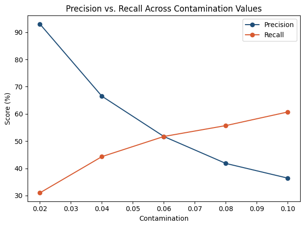

# Journal Entry Anomaly Detection

A machine learning project that flags journal entries that look risky, the kind of red flags an auditor looks for during Journal Entry Testing (JET). The model isn't given any rules ahead of time, it has to figure out on its own what looks off.

**This is a personal learning project.** I built it to actually understand machine learning instead of just using it as a black box. This was my first time working with unsupervised learning and anomaly detection. It's meant to show real, from-scratch understanding of ML fundamentals applied to a problem I already know from the accounting/finance side, not a production-ready audit tool.

## The problem

Companies post thousands of journal entries a month. Traditional Journal Entry Testing usually relies on random sampling or static rules like "flag anything over $X," and both of those miss things. Sampling might not even land on the bad entries, and rules only catch what someone already thought to write a rule for. I wanted to see if a model could learn what "normal" looks like for a given set of accounts, preparers, and approvers, then rank every entry by how much it deviates from that, without being told the rules up front.

## Why unsupervised learning

Real journal entry data basically never comes labeled as "this one was fraud." You don't know ahead of time which entries are anomalous, so a normal classification model won't work since it needs labeled examples to learn from. Instead I used `IsolationForest`, which just needs to see what entries typically look like, then scores every entry by how easily it gets isolated from the rest. If a point only takes a couple splits to separate from everything else, it's treated as more anomalous.

## The dataset

Real company journal entry data is never public, it's some of the most sensitive data a company has. So I built a synthetic dataset in Excel/pandas, 5,000 journal entries, with about 6% (300 entries) planted on purpose as anomalies across six types:

| Anomaly type | What it represents |
|---|---|
| Round-dollar amounts | Exact multiples of $1,000/$5,000/etc, real transactions are rarely this clean |
| Weekend / after-hours postings | Entries outside normal business hours |
| Just-under-threshold amounts | Entries sitting just below a $10,000 approval threshold |
| Preparer = approver | Same person created and approved the entry |
| Rare account pairing | A debit/credit account combo that almost never happens together |
| Unusual preparer for account | Someone posting to an account they don't normally touch |

I planted known anomalies instead of using a random unlabeled dataset so I could actually check the results. I know exactly which entries are anomalies, so I can measure precision and recall instead of just trusting whatever the model spits out. The full dataset with the answer key is in `data/journal_entries.xlsx`. The model only ever trains on the "no answer key" sheet.

## Feature engineering

The raw fields alone (account, preparer, approver, amount, timestamp) let the model catch anomalies where a single value looks weird, but it struggled with anomalies where it's the combination of values that's weird. To help with that I added three extra features before training:

- `account_pair_frequency`, how often this debit/credit account pairing shows up overall
- `preparer_account_frequency`, how often this preparer has posted to this specific account
- `preparer_is_approver`, a flag for entries where the same person prepared and approved

Worth noting: the model was never given the actual rules (like "flag round numbers"). It only saw raw and engineered features. It had to figure out on its own, statistically, that entries near those patterns tend to look different from the rest.

## Results

Accuracy alone is misleading here. Only about 6% of entries are anomalous, so a model that flagged nothing at all would still score around 94% accuracy.

| Metric | Score |
|---|---|
| Baseline (flag nothing) | 94.0% |
| Model accuracy | 94.2% |
| Model precision | 51.7% |
| Model recall | 51.7% |

Precision and recall tell the real story, and they trade off against `contamination` (the model's assumed anomaly rate):



| Contamination | Precision | Recall |
|---|---|---|
| 0.02 | 93.0% | 31.0% |
| 0.04 | 66.5% | 44.3% |
| 0.06 | 51.7% | 51.7% |
| 0.08 | 41.8% | 55.7% |
| 0.10 | 36.4% | 60.7% |

I went with contamination = 0.06 for the final model since that's where precision and recall balance out. In a real audit setting I'd probably lean toward recall over precision, since missing a real anomaly is usually worse than an auditor spending a few extra minutes on a false positive. But I also had ground truth telling me 6% was the actual rate here, which you wouldn't know on real data, so 0.06 is a reasonable starting point rather than a final answer.

## Rules vs. machine learning

Before trusting the model I built a simple rules-based baseline (three plain conditions: round-dollar, weekend/after-hours, just-under-threshold) to see how much of this problem basic statistics could already solve.

| Anomaly type | Rules baseline | Model |
|---|---|---|
| Round-dollar | 100% | 30% |
| Weekend / after-hours | 100% | 34% |
| Just-under-threshold | 100% | 36% |
| Preparer = approver | 0% | 44% |
| Rare account pairing | 0% | 92% |
| Unusual preparer for account | 0% | 74% |

This isn't "ML beats rules." On the three categories they're built for, hard-coded rules are perfect and cost nothing to run. The real finding is that rules and ML are complementary, not competing. Rules work great for anomalies defined by a single value crossing a clear line. The model is the only thing here that catches anomalies defined by an unusual combination of values, something you'd basically never be able to write a static rule for since you'd have to manually list out every normal combination in advance. A real system would probably run both.

## Limitations

- This is a first-pass filter, not a fraud determination. Every flagged entry still needs a human to look at it.
- It's trained and tested on synthetic data with clearly planted anomalies. Real anomalies are messier and probably won't separate this cleanly.
- I tuned `contamination` against a known answer key here. On real data you don't know the true anomaly rate, so this would need to be set based on audit experience or how much a team can realistically review.
- It's still weaker on combination-based anomalies than single-value ones, even with the added features. Something like an autoencoder might close that gap further, but that wasn't the focus of this project.

## Tools

Built in Python (pandas, scikit-learn, matplotlib) in Google Colab. I used Claude as a coding assistant and tutor throughout, for writing/explaining code and as a sounding board for interpreting results and making decisions (why unsupervised over supervised, how to read the precision/recall tradeoff, why the rules vs model comparison mattered). The direction, decisions, and interpretation of the results are mine. This README reflects my own understanding of what the project does and why.

## Repo structure

```
journal-entry-anomaly-detection/
├── README.md
├── data/journal_entries.xlsx
├── notebook/anomaly_detection.ipynb
├── images/
│   ├── catch_rate_by_type.png
│   └── precision_recall_sweep.png
└── requirements.txt
```
